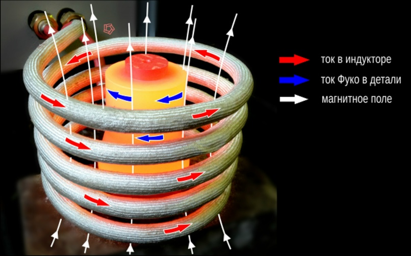
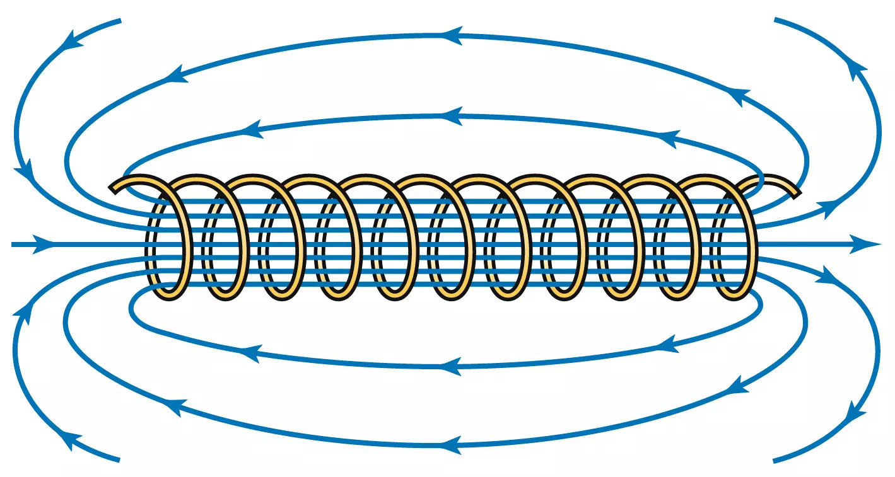
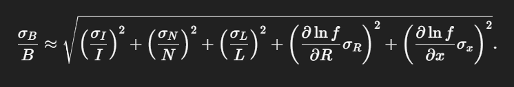
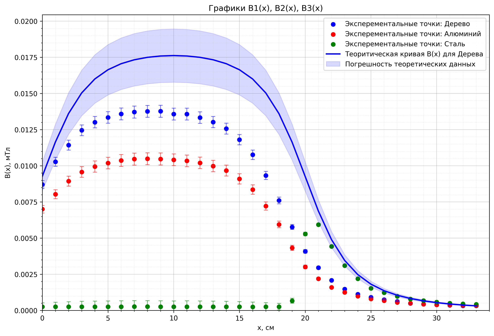
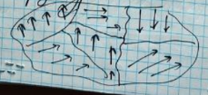
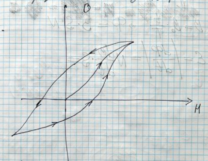

## 1) Вывод формулы - связи ЭДС и $В$:

Так как в большой катушке течет переменный ток, ее магнитное поле меняется по закону:
$$B = B_{max}\cos(wt)$$
По закону Фарадея ЭДС в измерительной катушке меняется следующим образом:
$${\LARGE \varepsilon}=-\frac{d\Phi}{dt}=-W_{1}S\frac{dB}{dt}=W_{1}\frac{\pi d_{1}^2}{4}B_{max}w\sin(wt)$$
Отсюда можно получить связь максимальных ${\LARGE \varepsilon}$ и $B$:
$${\LARGE \varepsilon}_{max}=W_{1}\frac{\pi d_{1}^2}{4}B_{max}w$$
Или для эффективных значений:
$${\LARGE \varepsilon}_{эф}=2{\pi}νW_{1}\frac{\pi d_{1}^2}{4}B_{эф}$$
Выразив $B_{эф}$ и преобразовав, получаем итоговый результат:
$$B_{эф} = \frac{2{\LARGE \varepsilon}_{эф}}{{\pi}^2d_{1}^2νW_{1}}$$

## 2) Теоретический анализ влияния наличия сердечника на величину напряженности магнитного поля на оси катушки

### Алюминиевый сердечник

Алюминий - парамагнетик. Его магнитная проницаемость больше единицы, а значит, на первый взгляд, поле внутри катушки должно увеличиться. Однако на практике наблюдается спад поля на несколько десятков процентов по сравнению со случаем без сердечника.

Основная причина заключается в возникновении вихревых токов (токов Фуко) внутри сердечника. Их порождает переменное магнитное поле. Эти токи, в соответствии с законом Фарадея, в каждый момент времени направлены против тока в катушке, а значит создают новое магнитное поле, направленное против исследуемого.

## Железный сердечник

Железо - ферромагнетик. Его магнитная восприимчивость в миллионы раз выше, чем у алюминия. Это, казалось бы, противоречит практике: магнитного поля на оси соленоида нет. Однако это можно объяснить несколькими обстоятельствами:

1. Вихревые токи, описанные выше
2. Уменьшение силы тока. Когда мы вставили железный сердечник в катушку для проведения измерений, заметили характерный спад силы тока на амперметре. Это обуславливается тем, что индуктивность прямо пропорциональна $\mu$:
   $$L = \mu_0 \mu \frac{N^2 S}{l}$$
   При больших $\mu$ индуктивное сопротивление катушки становится не пренебрежимо огромным, что приводит к уменьшению силы тока, что влечет за собой спад напряженности.

   Исходя из экспериментальных данных, поле с алюминиевым сердечником падает примерно на 23.2 %

3. Краевые эффекты. Внутри катушки магнитное поле является однородным и прямолинейным, в отличие от ситауции на краях. Именно из-за того, что магнитные линии расходятся при выходе или входе в катушку, мы имеем такой всплеск при $x > L$ для железного сердечника.

   

---

# Погрешности:

Относительная погрешность рассчетов получается из:

Учитывая погрешность вольтметра, можем построить эксперементальные точки, а при помощи формулы выше получаем Теоретическую кривую зависимости Магнитной индукции `B` от координаты `x`:

Учитывая погрешности Вольтметра, Амперметра и линейки, а так же получив, что:
${\varepsilon}_{теоретическая} = <B> \sqrt{{\varepsilon_{{отн}_А}^2} + {\varepsilon_{{отн}_L}^2} + {\varepsilon_{{отн}}^2}(\cos{\beta_1} - \cos{\beta_2})}$, где :

- $\varepsilon_{{отн}_L} = 0.1$
- $\varepsilon_{{отн}_A} = 0.1$
- ${\varepsilon_{{отн}}}(\cos{\beta_1} - \cos{\beta_2}) = \frac{\varepsilon_{\beta_1}\cos{\beta_1} - \varepsilon_{\beta_2}\cos{\beta_2}}{\cos{\beta_1} - \cos{\beta_2}}$
- $\varepsilon_{\beta_1} = \frac{R_{сред}^2}{R_{сред}^2 + L^2}*\varepsilon_L$
- $\varepsilon_{\beta_2} = \frac{R_{сред}^2}{R_{сред}^2 + (L-x)^2}*\varepsilon_L$

**А так же**

> Из зависимости $B(x) = \mu_0 H(x)$, описанной в теории лабораторной работы
> ($B(x) = \mu_0 \frac{IW}{2L} (\cos{\beta_1} - \cos{\beta_2})$):

- $\cos_{\beta_1} = \frac{x}{\sqrt{x^2 + R_{средн}^2}}$
- $\cos_{\beta_2} = \frac{x-L}{\sqrt{(x-L)^2 + R_{средн}^2}}$

**В итоге получаем для теоретических данных:**

|№|X, мм |B(x), мТл |
|:-------:|:-----:|:-------:|
|1 |0 |8.44 |
|2 |10 |10.61 |
|3 |20 |12.41 |
|4 |30 |13.71 |
|5 |40 |14.59 |
|6 |50 |15.18 |
|7 |60 |15.57 |
|8 |70 |15.84 |
|9 |80 |16.01 |
|10 |90 |16.12 |
|11 |100 |16.18 |
|12 |110 |16.20 |
|13 |120 |16.18 |
|14 |130 |16.12 |
|15 |140 |16.01 |
|16 |150 |15.84 |
|17 |160 |15.57 |
|18 |170 |15.18 |
|19 |180 |14.59 |
|20 |190 |13.71 |
|21 |200 |12.41 |
|22 |210 |10.61 |
|23 |220 |8.44 |
|24 |230 |6.27 |
|25 |240 |4.47 |
|26 |250 |3.16 |
|27 |260 |2.27 |
|28 |270 |1.66 |
|29 |280 |1.25 |
|30 |290 |0.97 |
|31 |300 |0.76 |
|32 |310 |0.61 |
|33 |320 |0.50 |
|34 |330 |0.41 |

---

---

## Контрольные вопросы:

> Почему магнитные свойства алюминия и железа так сильно различаются, если сравнивать магнитные восприимчивости $\chi = \mu - 1$, то они отличаются в миллионы раз!

### Ответ:

- Al Является парамагнетиком, а Сталь состоит из сплава Fe, Co, Ni, которые являются ферромагнетиками. У Парамагнетиков $\chi$ порядка $10^{-5}$ Есть собственные магнитные моменты $p_m$, которые усиливают магнитное поле, втягиватся в сильное магнитное поле $B$

У ферромагнетиков $\chi$ порядка $10^{5}-10^{5}$ Очень сильно усливает поле $B$.
А еще есть доменная структура:

Так же для ферромагнетиков характерно такое явление, как Гитерезии, то есть когда $\chi \not = const$

---

---

> Как изменится результат измерений поля на оси соленоида с алюминиевым сердечником на переменном токе, если на соленоид вместо синусоидального напрядения подать пилообразное?

### Ответ:

- ***

  ***

> Тепловая энергия, выделяющаяся в алюминиевом или стальном сердечнике в случае переменного напряжения берется из-за токов Фуко, которые возникают из-за закона электромагнитной индукции Фарадея
